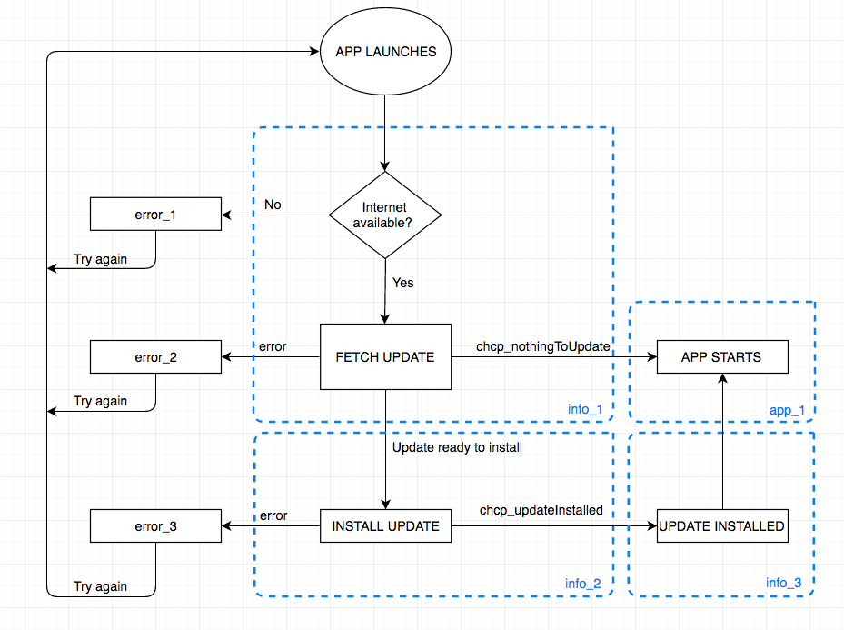

# worona-chcp-layout
Layout to display the different states during hot-code-push.

### Flow Diagram

### Screens

- **info_1** Checking for updates ([preview](https://worona.github.io/worona-chcp-layout/html/info_1.html))

- **info_2** Installing update ([preview](https://worona.github.io/worona-chcp-layout/html/info_2.html))

- **info_3** Update installed ([preview](https://worona.github.io/worona-chcp-layout/html/info_3.html))

- **app_1** Launching App ([preview](https://worona.github.io/worona-chcp-layout/html/app_1.html))

- **error_1** No internet connexion ([preview](https://worona.github.io/worona-chcp-layout/html/error_1.html))

- **error_2** Error downloading update ([preview](https://worona.github.io/worona-chcp-layout/html/error_2.html))

- **error_3** Error installing update ([preview](https://worona.github.io/worona-chcp-layout/html/error_3.html))

### Flows

** No internet connexion: ** [info_1](https://worona.github.io/worona-chcp-layout/html/info_1.html) → [error_1](https://worona.github.io/worona-chcp-layout/html/error_1.html)

** Nothing to update: ** [info_1](https://worona.github.io/worona-chcp-layout/html/info_1.html) → [app_1](https://worona.github.io/worona-chcp-layout/html/app_1.html)

** Update available: ** [info_1](https://worona.github.io/worona-chcp-layout/html/info_1.html) →
[info_2](https://worona.github.io/worona-chcp-layout/html/info_2.html) →
[info_3](https://worona.github.io/worona-chcp-layout/html/info_3.html) → [app_1](https://worona.github.io/worona-chcp-layout/html/app_1.html)

** Error downloading update: ** [info_1](https://worona.github.io/worona-chcp-layout/html/info_1.html) →
[error_2](https://worona.github.io/worona-chcp-layout/html/error_2.html)

** Error installing update: ** [info_1](https://worona.github.io/worona-chcp-layout/html/info_1.html) →
[info_2](https://worona.github.io/worona-chcp-layout/html/info_2.html) →
[error_3](https://worona.github.io/worona-chcp-layout/html/error_3.html)
